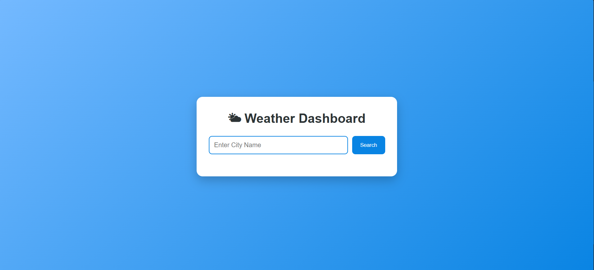
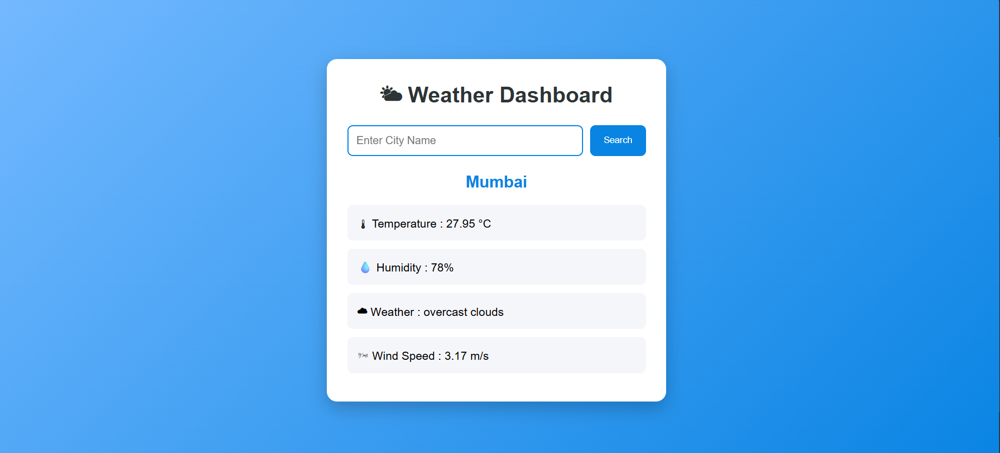

# 🌤 Weather Dashboard

A simple Weather Dashboard built with **Flask** that fetches real-time weather information using the **OpenWeather API**.

This project was created as a mini project to practice working with APIs, JSON responses, and Flask.

---

## ✨ Features

- 🔍 Search weather by city name
- 🌡 Display current temperature
- 💧 Display humidity
- ☁ Display weather description
- 🌬 Display wind speed
- ❌ Handles invalid city names
- ⚠ Handles empty input
- 📱 Responsive UI

---

## 🛠 Technologies Used

- Python
- Flask
- HTML
- CSS
- Requests Library
- OpenWeather API

---

## 📂 Project Structure

```
Weather Dashboard/
│
├── app.py
├── .env
├── .gitignore
│
├── static/
│   └── style.css
│
├── templates/
│   └── index.html
│
└── README.md
```

---

## 🚀 Installation

### Clone the repository

```bash
git clone https://github.com/YOUR_USERNAME/flask-weather-dashboard.git
```

### Move into the project

```bash
cd flask-weather-dashboard
```

### Install dependencies

```bash
pip install -r requirements.txt
```

### Create a `.env` file

```text
API_KEY=YOUR_OPENWEATHER_API_KEY
```

### Run the application

```bash
python app.py
```

---

## 📸 Screenshot




---

## 📚 What I Learned

- Working with REST APIs
- Making HTTP requests using the Requests library
- Parsing JSON data
- Handling API errors
- Passing data from Flask to HTML templates
- Basic environment variable management using `.env`

---

## 👨‍💻 Author

Made with ❤️ by **Ashutosh Shioorkar**
